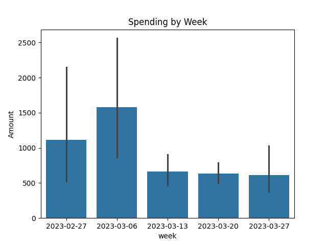
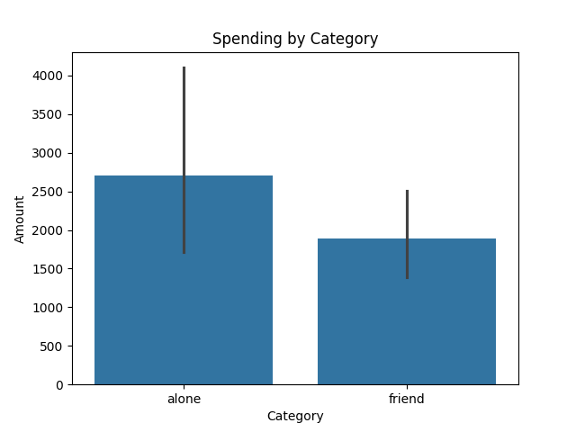
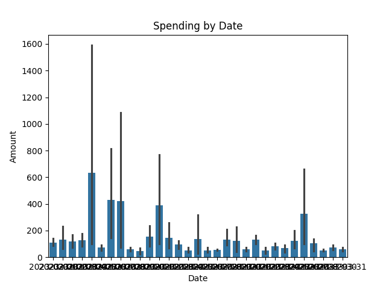

# 💸 Personal Expense Data Analysis Project

This is my first AI/ML-based project where I analyzed personal expense data using Python libraries like **Pandas**, **NumPy**, and **Matplotlib**.  
The goal of this project is to visualize how expenses vary by week, category, and date to better understand personal spending habits.

---

## 📂 Dataset

- **Source:** [Kaggle - Personal Expense Data](https://www.kaggle.com/datasets/sanjay3454chauhan/personal-expense-data?resource=download)
- **Filename:** `budget_data.csv`
- **Columns:**
  1. `Date` - The date of the expense  
  2. `Item` - What was purchased  
  3. `Amount` - How much money was spent  
  4. `Category` - Whether the item was bought alone or with friends  
  5. `Time` - Time of the expense (morning/evening/etc.)  
  6. `Day` - Day of the week  

---

## 🧪 Technologies Used

- Python 3
- NumPy
- Pandas
- Matplotlib

---

## 📊 Visualizations

### 1. Weekly Spending Analysis
Shows total expenses grouped by week.



---

### 2. Spending by Category
Visualizes expenses based on whether the purchase was made alone or with friends.



---

### 3. Daily Spending Pattern
Tracks daily spending trends throughout the dataset.



---

## ⚙️ How to Run

1. Clone or download this project.
2. Make sure Python and the required libraries are installed:
   ```bash
   pip install pandas numpy matplotlib
   ```
3. Run the data analysis script:
   ```bash
   python src/dataanalysis.py
   ```
4. Run the graph visualization script:
   ```bash
   python src/graph_analysis.py
   ```

---

## 📁 Folder Structure

```
expense-analyzer/
├── data/
│   └── budget_data.csv
├── images/
│   ├── day_spending_analysis.png
│   ├── spending_by_catagorypng.png
│   └── spending_by_date.png
├── src/
│   ├── dataanalysis.py
│   └── graph_analysis.py
└── README.md
```

---

## ✅ Next Steps

- Add more insights like monthly spending, top expensive items
- Try unsupervised learning (e.g. clustering spending behavior)
- Deploy this project using Streamlit or Flask

---

## 🙌 Credits

Dataset by Sanjay Chauhan on Kaggle:  
[https://www.kaggle.com/datasets/sanjay3454chauhan/personal-expense-data](https://www.kaggle.com/datasets/sanjay3454chauhan/personal-expense-data)
